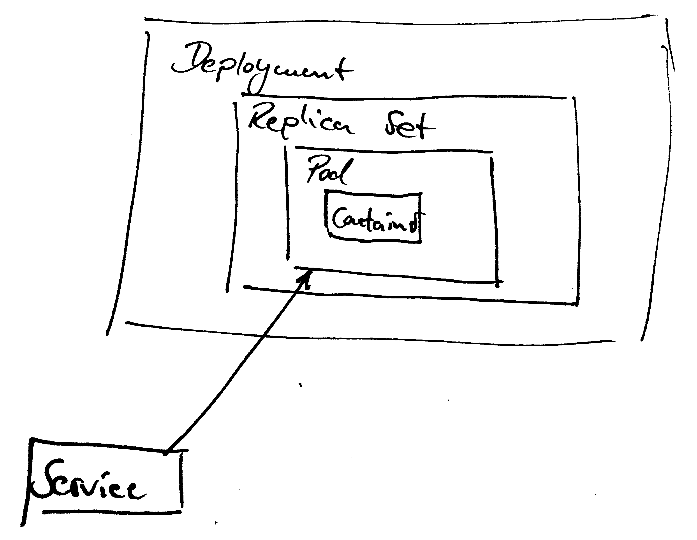
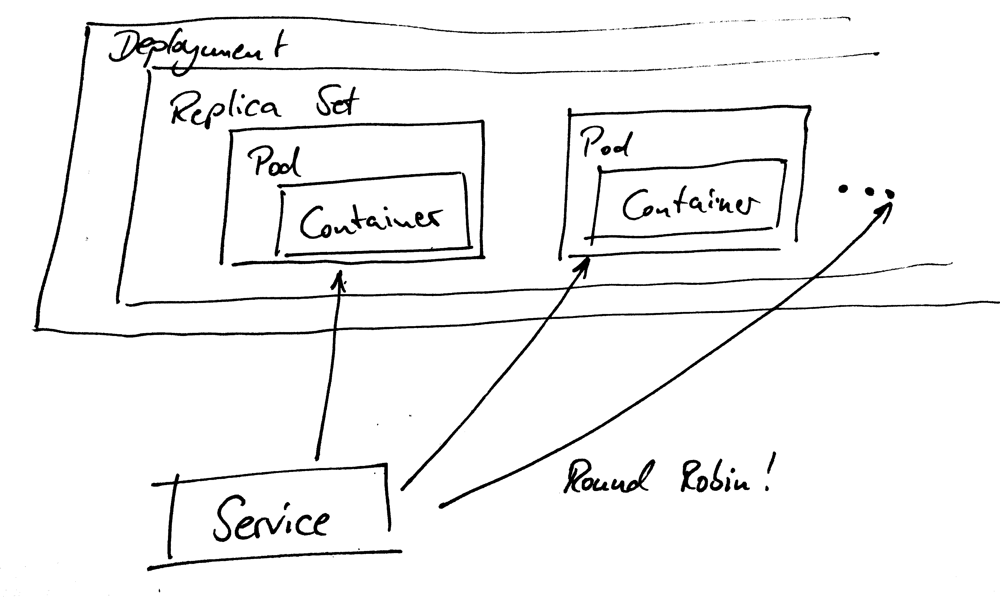
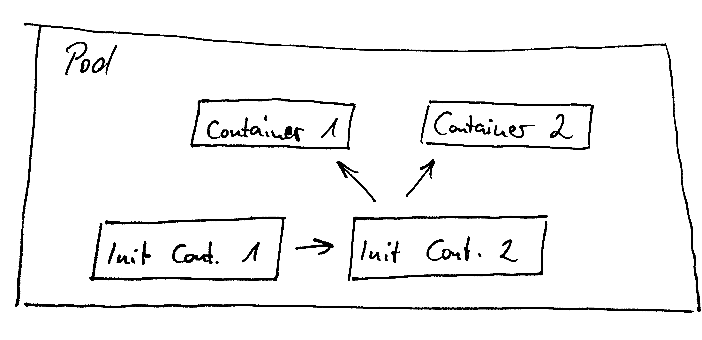

# Stairway to   Service Mesh

Stefan Siegl (@stesie23, <rolf@mayflower.de>)

<!--s-->

# Agenda

* (brief) Kubernetes Refresher
* Why Service Mesh?
* Why Istio?
* Traffic control & mTLS
* How does it work?
* Moar goodness

<!--s-->

# Kubernetes Refresher

<!--v-->

<!--v-->

<!--v-->

