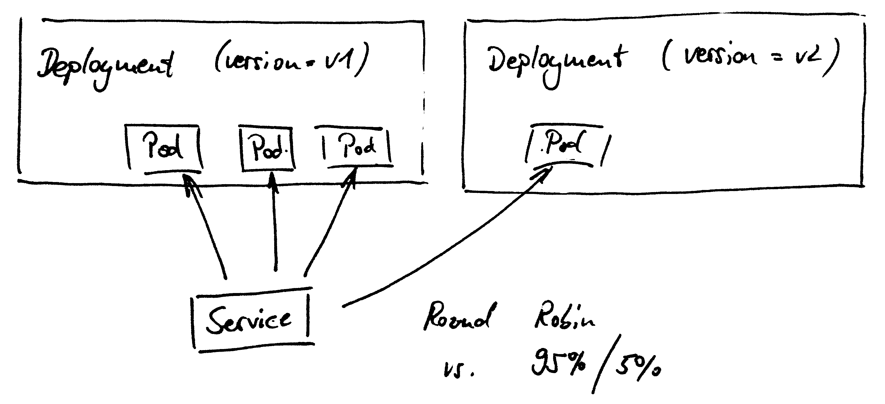
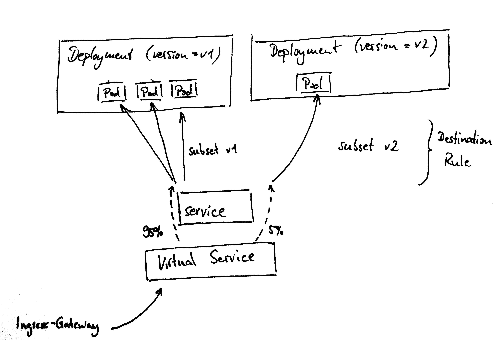
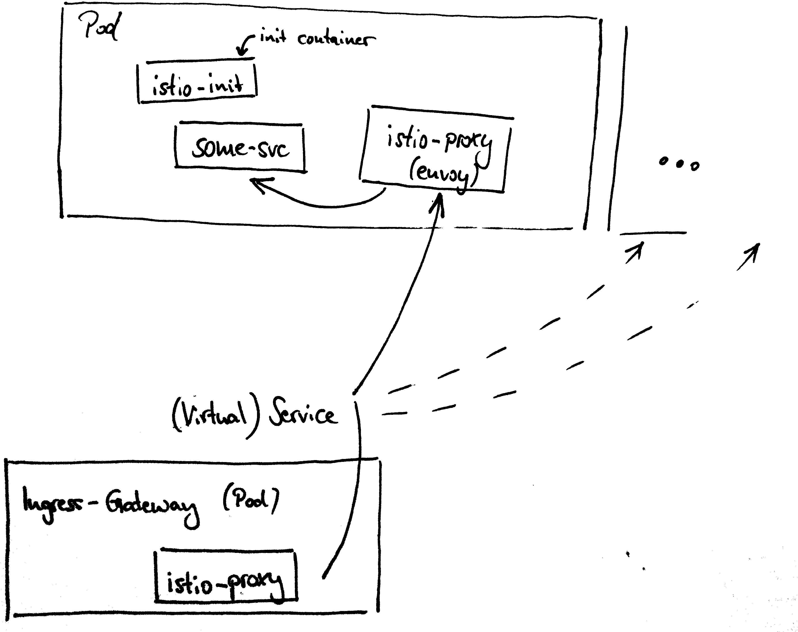
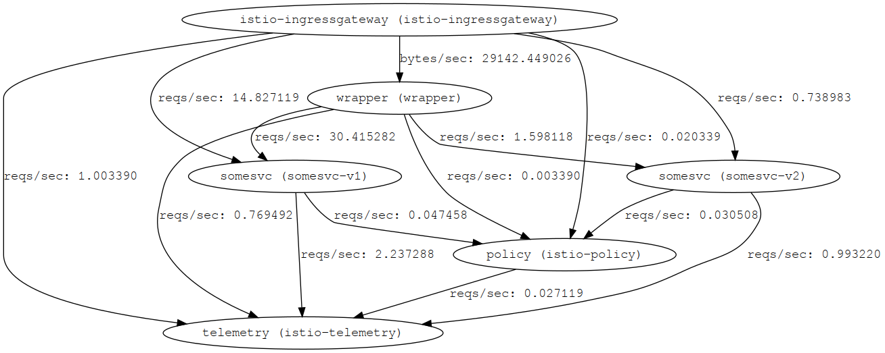
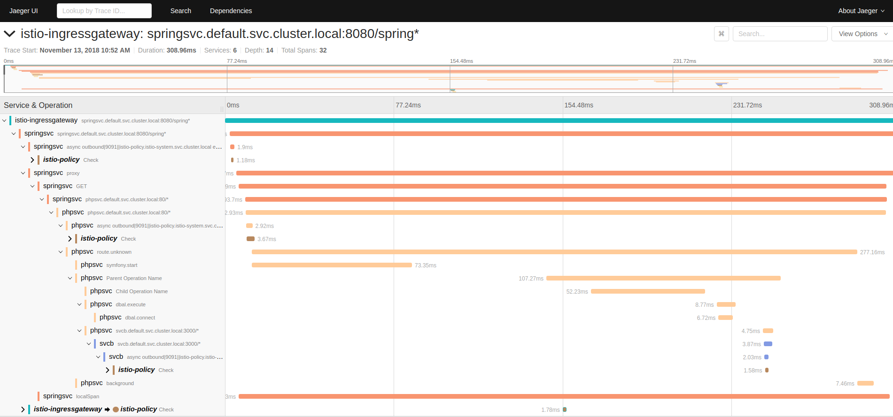

# Stairway to <br> Service Mesh

Stefan Siegl (@stesie23, <rolf@mayflower.de>)

<!--s-->

# Agenda

* (brief) Kubernetes Recap
* Why Service Mesh? Why Istio?
* Traffic control
* How does it work?
* Moar goodness

<!--s-->

# Kubernetes Recap

<!--v-->


<!--v-->


<!--v-->


<!--s-->

# Why Service Mesh?

<!--v-->

so we've got an increasing number of microservices ...

<!--v-->

all integrating over http ...

<!--v-->

* which one is talking to which one?
* how many requests (and errors) are there?
* how to deploy a canary release?
* how to avoid cascading effects in overload situations?
* how to instrument external services?
* how to test fault scenarios?

<!--v-->

... without modifying the app itself!?

<!--v-->

## Why Istio?

* AWS & Azure both provide proprietary solutions  
  ⇨ vendor lock-in
* Free Software (Apache 2.0 license)
* Istio supported by Google
* ... and provided on GKE since recently
* Google's Knative on top of Istio

<!--v-->

> upwards of 90 percent of Kubernetes users will be running Istio within the next two years

Urs Hölzle, Senior VP Technical Infrastructure at Google

<!--v-->

## Istio Basics

* set of Kubernetes CRDs (+ Controllers)
* lot's of YAML resource definitions \o/
* Control Plane
  * pilot (config mgmt)
  * mixer (auth & stats)
  * citadel (certs)

<!--s-->

# Traffic Control

* canary release: split traffic 95% - 5%
* or route traffic based on user agent
* or actually just any HTTP header

<!--v-->



**Problem**: cannot control traffic between v1 & v2  :-(

<!--v-->

DEMO: curl to Service's NodePort

<!--v-->

## Istio to the rescue!

* create subsets with `DestinationRule`
* route to subsets via `VirtualService`

<!--v-->



<!--v-->

```yaml
apiVersion: "networking.istio.io/v1alpha3"
kind: "DestinationRule"
metadata:
  name: somesvc
spec:
  host: somesvc
  subsets:
    - name: v1
      labels:
        version: v1
    - name: v2
      labels:
        version: v2
```

<!--v-->

```yaml
apiVersion: networking.istio.io/v1alpha3
kind: VirtualService
metadata:
  name: somesvc
spec:
  ...
    route:
    - destination:
        host: somesvc
        subset: v1
      weight: 95
    - destination:
        host: somesvc
        subset: v2
      weight: 5
```

<!--v-->

DEMO: curl to ingressgateway

<!--v-->

## so how does it work?

<!--v-->

```
$ kubectl get pods
NAME                          READY     STATUS    RESTARTS   AGE
somesvc-v1-74666f9dd9-bgj9j   2/2       Running   0          2h
```

<!--v-->

## what is this secondary container?

... and where does it come from?

<!--v-->



<!--v-->

manual mode:

```
$ istioctl kube-inject -f deployment.yml | kubectl apply -f -
```

automatic:

```
$ kubectl label namespace default istio-injection=enabled
```

<!--s-->

# External Services

* ever faced an outage due to an external service?
* limit the maximum request time?
* limit maximum number of concurrent requests?
* what happens if latencies increase, or http errors occur?

<!--v-->

## HTTP traffic

* instrumentation like with internal traffic
* `ServiceEntry`: declare external service
* `VirtualService`: request timeouts & fault injection
* `DestinationRule`: configure connection pool

<!--v-->

## HTTPS traffic

* `VirtualService` can match based on TLS SNI
* timeouts can be configured
* yet fault injection doesn't work (due to encryption)

<!--v-->

## Solution (work-around)

* let app speak "http" on port 443 (sic!)
* set `tls.mode = SIMPLE` on `DestinationRule`
* envoy will handle encryption and sees unencrypted traffic now
* ... hence able to inject faults

<!--v-->

also applies to runtime (debugging) package installs

```
$ docker run -ti  --privileged --net=container:k8s_POD_somesvc-v2-599679685-w48kn_default_0f32e005-f78e-11e8-a17c-080027684af6_0 alpine
/ # apk add iptables
fetch http://dl-cdn.alpinelinux.org/alpine/v3.8/main/x86_64/APKINDEX.tar.gz
ERROR: http://dl-cdn.alpinelinux.org/alpine/v3.8/main: No such file or directory
WARNING: Ignoring APKINDEX.adfa7ceb.tar.gz: No such file or directory
...
```

<!--v-->

External services need to be whitelisted

```yaml
apiVersion: networking.istio.io/v1alpha3
kind: ServiceEntry
metadata:
  name: alpine
spec:
  hosts:
  - dl-cdn.alpinelinux.org
  ports:
  - number: 80
    name: http
    protocol: HTTP
  resolution: NONE
  location: MESH_EXTERNAL
```

<!--s-->

## Traffic visualisation

<!--v-->

* simplest approach: servicegraph
* servicegraph must be enabled
* not exposed by default, must port-forward

<!--v-->



<!--v-->

```
$ kubectl port-forward -n istio-system service/servicegraph 8088
```

http://localhost:8088/force/forcegraph.html

<!--v-->

## Alternatives

* Kiali - interactive, just-in-time traffic monitor
* Jaeger - open-tracing compatible tracing
  * envoy proxies automatically collect tracing data
  * app must (at least) forward X-B3-xxx headers
  * (optional) further instrumentation within app

<!--v-->



<!--s-->

# moar goodness

<!--v-->

## mutual TLS

* most microservices use plain http traffic
* neither encrypted nor authenticated
* Istio provides *mutual TLS*
  * citadel creates key/certificate pairs
  * provided to pods istio-proxy pods via secrets
  * envoy verifies certificates & encrypts traffic

<!--v-->

## authentication

* configure istio to require authentication on certain services
* ... validates JWT tokens for your app
* default rules can be applied to namespace
* ... and later be overriden per service

<!--v-->

## more integrations

* Prometheus
* Grafana


<!--s-->

# That's it!

## Questions?

Stefan Siegl (@stesie23, <rolf@mayflower.de>)

<!--s-->

# Workshop

```
$ git clone https://git.mayflower.de/stefan.siegl/istio-workshop.git
$ cd istio-workshop; view README.md
```

try stuff | break things | ask questions

... eat pizza :)
